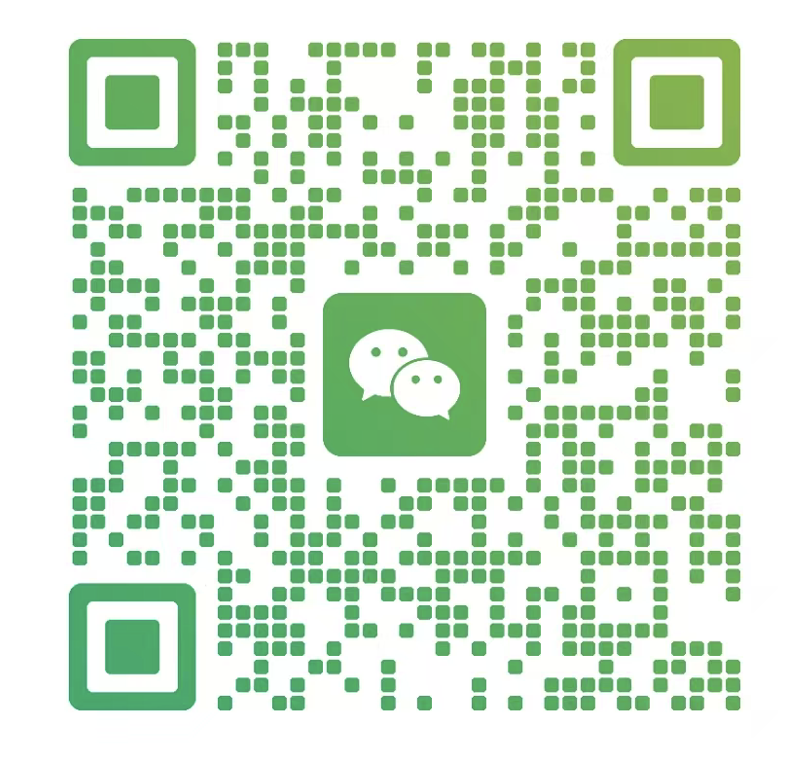

# SyNodeAi OpenClaw Plugin

> Every message is an event. Every chat is an agent.
>
> 基于 OpenClaw + SyNodeAi API + Webhook 的微信通道插件，让微信成为可运行 AI Agent 的事件驱动入口。

[](#)
[](#)
[](#)

SyNodeAi OpenClaw Plugin 用于把微信私聊 / 群聊接入 OpenClaw，使每一条消息都能进入 Agent Runtime，触发 Tool / Skill / Workflow 调度。

---

## 为什么做这个插件

---

微信不只是聊天工具。

在 OpenClaw 体系里，微信可以被看作：

- **高活跃入口**：天然承载真实用户会话
- **事件源**：每条消息都可以转换为 Agent Event
- **执行环境**：每个会话都可以成为独立上下文 Runtime
- **能力承载层**：可以继续挂载 Tool、Skill、Workflow、ACP 持久会话

你可以把它理解为：

> WeChat = Event Source  
> OpenClaw = Runtime  
> Agent = Execution Unit  
> Tool / Skill = Capability Layer

---

## 🧠 Architecture

```
WeChat
   ↓
Channel (SyNodeAi)
   ↓
OpenClaw Runtime
   ↓
Agent
   ↓
Tool / Skill / Workflow
   ↓
Response → WeChat
```

---

## 功能特性

### 通道能力

- 支持微信私聊 / 群聊接入
- 支持 SyNodeAi API + Webhook 回调
- 支持消息转 Event
- 支持接入 OpenClaw Channel 体系

### Agent 执行能力

- 每个会话独立上下文
- 支持 bindings 路由到指定 Agent
- 支持 ACP 持久会话
- 支持群聊 / 私聊细粒度触发策略

### 微信特性支持

- 支持 `@` 触发 / 引用触发
- 支持引用回复 / 普通回复 / `@发送者`
- 支持撤回消息
- 支持转发已有富消息
- 支持表情 / 名片 / 小程序 / appmsg / 链接等富消息
- 支持群成员目录读取与已知对象缓存

### 媒体与语音能力

- 支持媒体上传
- 支持 `mediaPublicUrl` 本地反代
- 支持 S3 兼容上传
- 支持语音自动转 silk
- 支持自动下载 `rust-silk`
- 支持 ffmpeg / ffprobe 处理媒体

---

## Demo

> 这不是自动回复，而是一次完整的 Agent 调度执行。

<p align="center">
  
</p>

你可以用它来：

- 做 AI 客服
- 自动跟进客户
- 群内智能助手
- 多 Agent 协作执行任务

👉 每一次对话，都会触发一次 Agent 执行

---

## 👋 加我交流（微信）

如果你对这个项目感兴趣，欢迎一起交流：

- Agent 架构设计
- 微信 × AI 场景
- Skill / Tool 开发
- 私域自动化玩法

> [!IMPORTANT]
> 扫码加我交流

<p align="center">
  
</p>

---

## 快速开始

### 方式一：傻瓜式接入

点击进入：<http://synodeai.webotchat.com/openclaw>

> [!NOTE]
> 用户最简单配置接入，这个入口最靠谱。

### 方式二：从 npm 安装

```bash
openclaw plugins install synodeai
```

### 方式三：从本地目录安装

```bash
openclaw plugins install /path/to/synodeai
```

### 方式四：软链接安装（开发调试）

```bash
openclaw plugins install --link /path/to/synodeai
```

### 方式五：从归档安装

OpenClaw 支持本地 `.zip` / `.tgz` / `.tar.gz` / `.tar`：

```bash
openclaw plugins install ./synodeai.tgz
```

> 安装或启用插件后需要重启 Gateway。

---

## Quickstart（推荐新用户用上面的方式1接入）

> 只需要 5 分钟，你就可以让微信跑起一个 AI Agent

### 第 1 步：安装插件

```bash
openclaw plugins install synodeai
```


### 第 2 步：登录 SyNodeAi 并获取 Token
打开以下地址，登录微信并完成绑定，获取 `token`：
```
http://synodeai.webotchat.com/quickstart
```

### 第 3 步：复制 json 配置文件到 `~/.openclaw/openclaw.json`

将你的配置文件复制到：

```text
~/.openclaw/openclaw.json
```

```json5
{
  "channels": {
    "synodeai": {
      "enabled": true,
      "token": "<synodeai-token>",
      "webhookPort": 4399,
      "webhookPath": "/webhook",
      "dmPolicy": "open"
    }
  }
}
```

> 群聊默认行为：所有人 @ 机器人才回复。如需自定义，参见下方「群聊配置」。

---

### 第 4 步：配置 Webhook（内网穿透，启动 OpenClaw 前完成）

Webhook 是 SyNodeAi 将微信消息推送到你本地 OpenClaw 的入口地址，必须公网可访问。

如在本地环境使用，推荐直接用 **ngrok** 做内网穿透：

#### 4.1 安装 ngrok

```bash
brew install ngrok
```

#### 4.2 配置 token

注册 ngrok 后获取 token，然后执行：

```bash
ngrok config add-authtoken YOUR_TOKEN
```

> `YOUR_TOKEN` 在 ngrok 官网注册后即可获取

#### 4.3 启动穿透

```bash
ngrok http 4399
```

你会看到类似：

```text
https://xxxx.ngrok-free.app -> http://localhost:4399
```

👉 这个 `https://xxxx.ngrok-free.app` 就是你的公网地址

---

### 第 5 步：在 SyNodeAi 填写 webhook

把上一步的公网地址按下面格式填写到 SyNodeAi：

```text
https://xxxx.ngrok-free.app/webhook
```

---

### 第 6 步：最后启动 OpenClaw

```bash
openclaw start
```

---

### 第 7 步：向机器人发一条微信消息验证

可以测试：

- 私聊直接发消息
- 群聊中 `@机器人`
- 群聊中引用机器人上一条消息继续追问

> [!IMPORTANT]
> 正确顺序是：
>
> 1. 登录微信（SyNodeAi）
> 2. 安装 OpenClaw plugin（synodeai）
> 3. 复制 json 配置文件到 `~/.openclaw/openclaw.json`
> 4. 配置 ngrok，拿到公网地址
> 5. 在 SyNodeAi 填写 webhook
> 6. 最后启动 `openclaw start`

---

## 🗺 Roadmap

- [x] 微信通道接入
- [x] Agent 调度
- [x] Tool 调用
- [ ] Skill 插件生态
- [ ] 多 Agent 协同
- [ ] 开发者平台

---

## 🧩 Use Cases

- 私域 AI 销售助手
- 微信群自动运营
- 客户自动跟进系统
- AI 协作机器人

---

## 常用配置项

| 配置项 | 说明 | 默认值 |
|--------|------|--------|
| `token` | SyNodeAi API Token | 必填 |
| `webhookPort` | Webhook 监听端口 | `4399` |
| `webhookPath` | Webhook 路径 | `/webhook` |
| `dmPolicy` | 私聊策略：`open` / `pairing` / `disabled` | `pairing` |
| `allowFrom` | 允许私聊的微信 ID 列表 | `[]` |
| `autoQuoteReply` | 自动引用回复 | `true` |
| `mediaPublicUrl` | 媒体反代公网地址（可选） | — |
| `s3Enabled` | 是否启用 S3 上传（可选） | `false` |
| `apiBaseUrl` | SyNodeAi API 地址 | `https://www.synodeaiapi.com` |

> 完整参数（S3、silk、ffmpeg 等高级配置）请参考 `src/config-schema.ts` 中的 Zod Schema 定义。

---

## 群聊配置

每个群独立配置，通过 `groups` 按群 ID 设置。**未配置的群默认：所有人 @ 回复。**

### 两个核心字段

| 字段 | 可选值 | 默认值 | 说明 |
|------|--------|--------|------|
| `access` | `all` / `allowlist` / `claim` | `all` | 谁能触发机器人 |
| `trigger` | `at` / `any` | `at` | 怎么触发（必须@还是任何消息） |

### 6 种组合

| access | trigger | 效果 |
|--------|---------|------|
| `all` | `at` | **默认** — 所有人 @ 机器人才回复 |
| `all` | `any` | 所有人发什么都回复（开放群） |
| `allowlist` | `at` | 白名单里的人 @ 才回复 |
| `allowlist` | `any` | 白名单里的人发什么都回复 |
| `claim` | `at` | 认领了的人 @ 才回复 |
| `claim` | `any` | 认领了的人发什么都回复 |

### 配置示例

```json5
{
  “channels”: {
    “synodeai”: {
      “groups”: {
        // 开放群：所有消息都回复
        “fun-room@chatroom”: {
          “access”: “all”,
          “trigger”: “any”
        },
        // @群（默认行为，可省略配置）：必须@才回复
        “work-room@chatroom”: {
          “trigger”: “at”
        },
        // 白名单群：只回复指定的人，不需要@
        “vip-room@chatroom”: {
          “access”: “allowlist”,
          “trigger”: “any”,
          “allowFrom”: [“wxid_admin”, “wxid_vip”]
        },
        // 白名单 + @：指定的人@才回复
        “ops-room@chatroom”: {
          “access”: “allowlist”,
          “allowFrom”: [“wxid_admin”],
          “trigger”: “at”
        },
        // 认领码群：成员认领后@才回复
        “public-room@chatroom”: {
          “access”: “claim”,
          “trigger”: “at”
        },
        // 认领码群：认领后发什么都回复
        “open-claim-room@chatroom”: {
          “access”: “claim”,
          “trigger”: “any”
        }
      }
    }
  }
}
```

### 回复样式

每个群还可以独立配置回复样式，通过 `reply.mode`：

- `plain`：普通回复
- `quote_source`：首条回复自动引用当前入站消息（默认）
- `at_sender`：首条文本回复自动 `@` 发送者
- `quote_and_at`：首条文本回复同时引用并 `@`

---

## 私聊触发与回复

`dms` 支持 `*` 默认项 + 精确项覆写：`dms[“*”]` / `dms[“<wxid>”]`

`dms[*].trigger.mode` 支持：

- `any_message`
- `quote`

`dms[*].reply.mode` 支持：

- `plain`
- `quote_source`

私聊默认触发是 `any_message`。私聊默认回复也会跟随 `autoQuoteReply` 回退到 `quote_source` 或 `plain`。

---

## 高级功能

以下功能面向进阶用户，详见源码和 `src/config-schema.ts`：

- **Agent 绑定**：通过顶层 `bindings[]` 把群/私聊路由到指定 Agent 或 ACP 持久会话
- **群白名单管理**：`synodeai_manage_group_allowlist` 工具支持 inspect / add / remove / replace / clear
- **绑定身份同步**：`synodeai_sync_group_binding` 工具同步机器人群昵称和备注
- **富消息**：支持 send / reply / unsend 标准动作，附带 `channelData[“synodeai”]` 传入引用回复、表情、名片、小程序、转发等
- **媒体 URL 策略**：优先 S3 → `mediaPublicUrl` 反代 → 本地
- **目录**：自动缓存已知私聊对象、群、群成员

> 配置变更后需重启 Gateway。

---

## 依赖

### npm 依赖

- `zod`

### peer 依赖

- `openclaw` (`>= 2026.1.29`)

### 系统级工具

- `ffmpeg` / `ffprobe`（用于视频缩略图与时长）
- `rust-silk`（出站语音转 silk + 入站语音解码；支持自动下载）
- 或者自行安装 `silk-encoder` / `silk-decoder` 并在配置中指定路径

### 网络 / 服务依赖

- SyNodeAi API 服务
- Webhook 回调需要公网可达（可配合 FRP）
- 媒体对外地址（`mediaPublicUrl`）

---

## Contributing

欢迎一起构建：

**微信 × Agent 的基础设施**

可以贡献：

- 新的 Skill
- 新的 Tool 适配
- 更强的路由 / 调度能力
- 富消息能力扩展
- Demo 与场景样例
- 文档与排错指南

如果这个项目对你有帮助，欢迎 Star。
